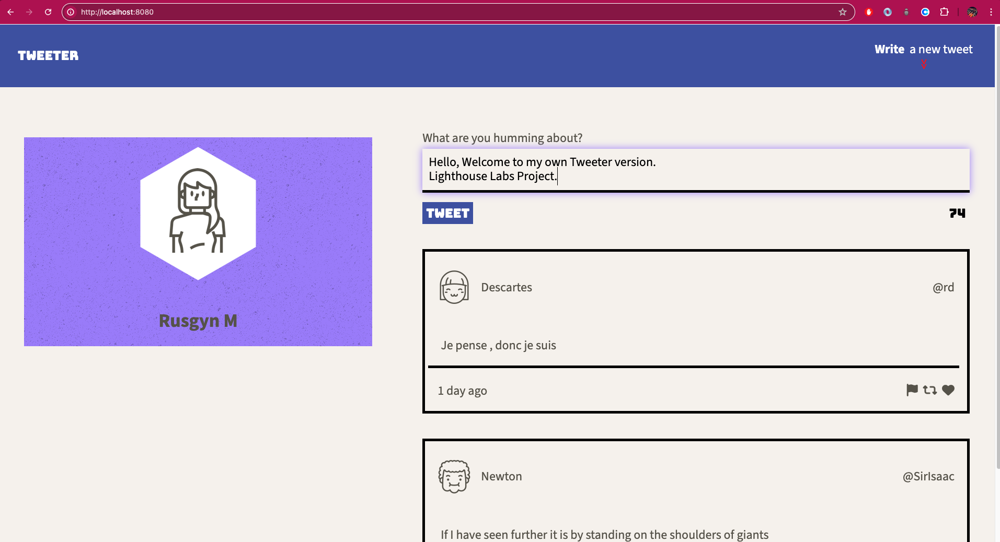
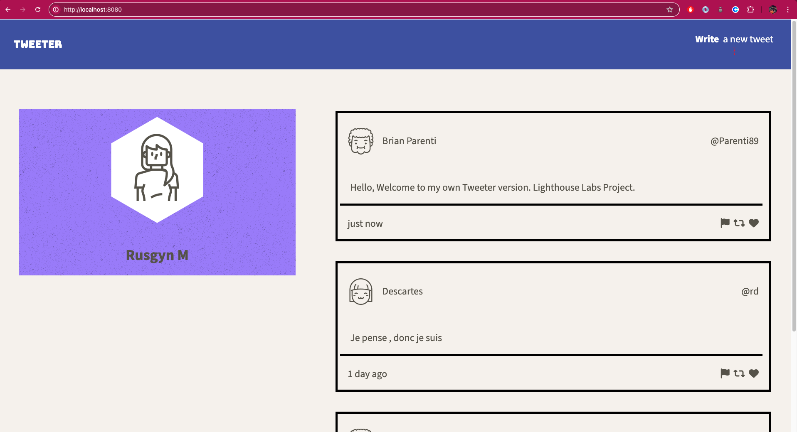
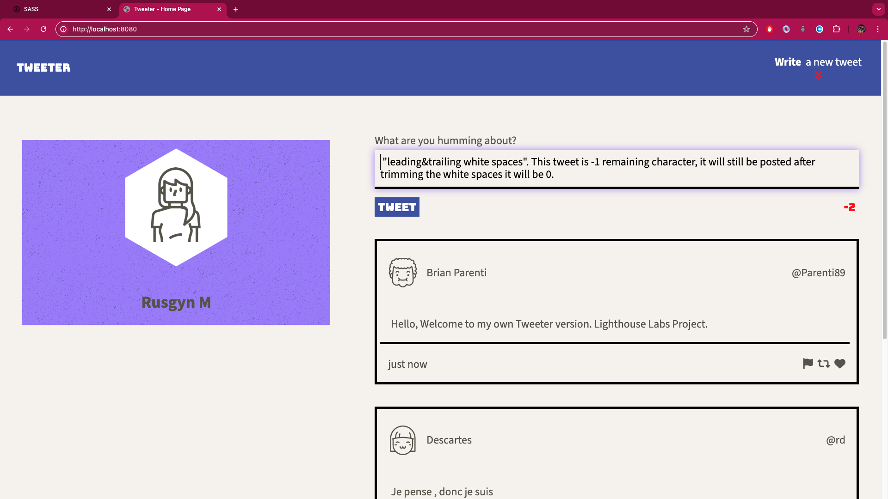
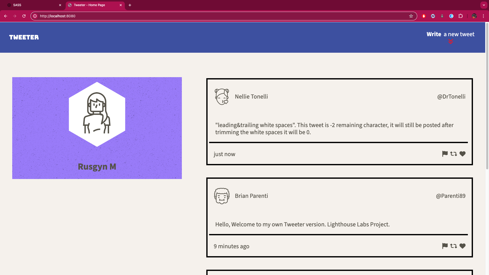
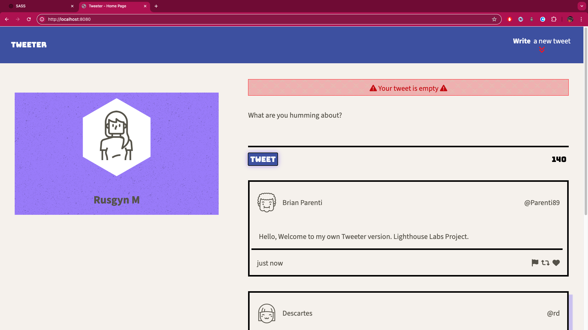
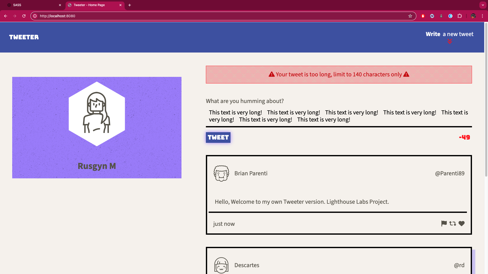
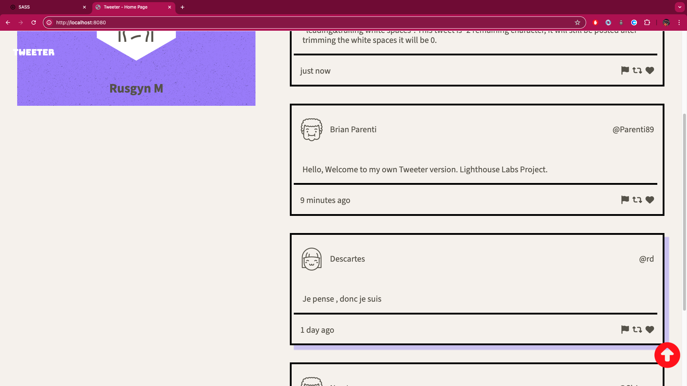
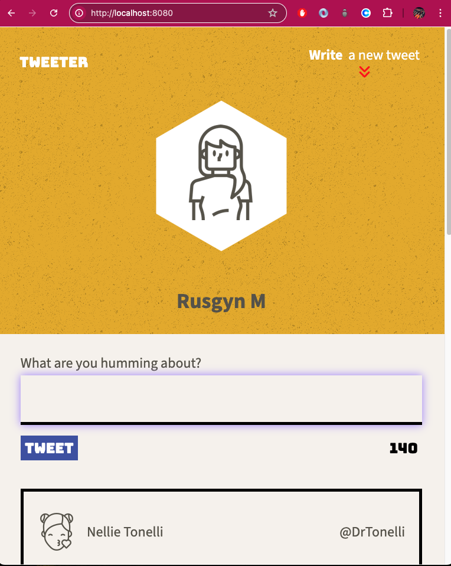
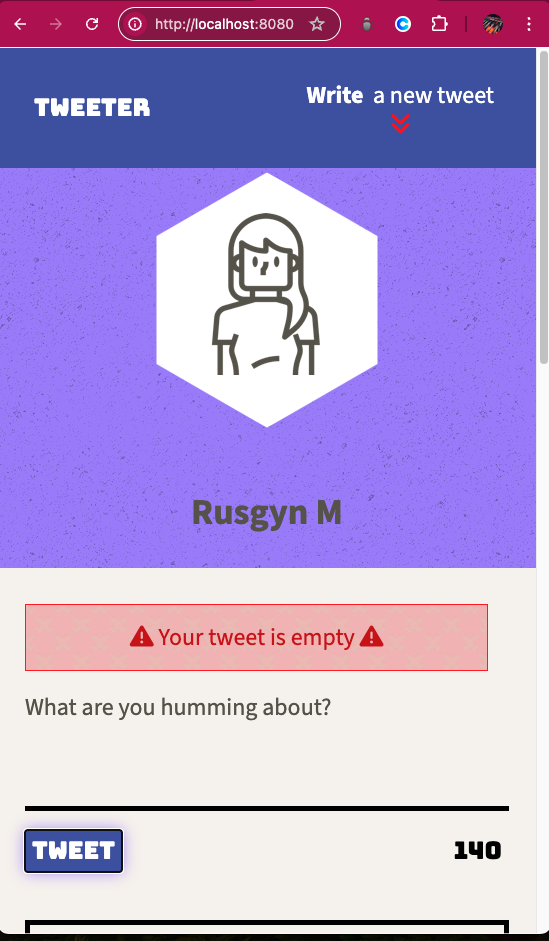
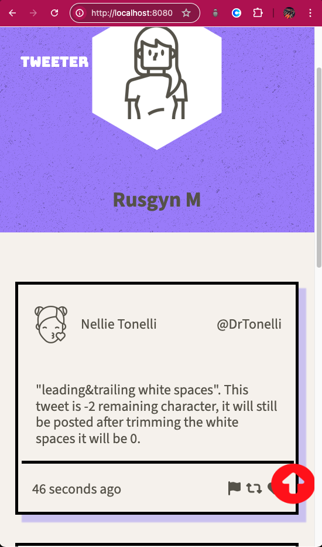

# Tweeter Project

Tweeter is a single-page Twitter clone, where users can create short posts of up to 140 characters and have them append to the main page. Posts are sequential, with the most recent posts appearing at the top of the page. To do so, Tweeter fetches a list of posts from a simplified ‘server’ and allows users to add posts to this list dynamically. All the requests will be made asynchronously, which will allow us to gain familiarity using the jQuery library to make these requests.

## Goal

* Build a single page application
* Connect the frontend to a pre-built backend
* Execute on a given design spec

## Dependencies

- Express
- Node 5.10.x or above

## Getting Started
### Executing the Program

1. Clone the repository [Tweeter](https://github.com/Rusgyn/tweeter) to your local device/machine. For reference, see Github [cloning](https://docs.github.com/en/repositories/creating-and-managing-repositories/cloning-a-repository) a repository steps.
2. Install the dependencies using `npm install` command

* Install express - Express is a lightweight and flexible routing framework with minimal core features meant to be augmented through the use of Express middleware modules.
```
npm install express
```

* Install Node - see [installation](https://nodejs.org/en/learn/getting-started/how-to-install-nodejs) guide

3. Open the file
4. On the [command line](https://developer.mozilla.org/en-US/docs/Learn/Tools_and_testing/Understanding_client-side_tools/Command_line), navigate to the root directory of your cloned Tweeter.
```
cd /path/to/where/you/save/Tweeter
```
5. Start the web server using the `npm run local` command. The app will be served at <http://localhost:8080/>.
```
npm run local
```
6. Go to <http://localhost:8080/> in your browser.

## Tweeter Project Images

1. Main Page


2. New Tweet Form. To write a new Tweet.


3. Writing a new Tweet



4. New Tweet Posted



5. Writing New Tweet with leading and/or trailing white space/s.



6. Trimmed, trailing or leading spaces removed/trimmed



7. Error Message: Posting Empty Tweet



8. Error Message: Posting Long Tweet



9. Bottom Button. Appears when you scroll down.



10. Bottom Button. Change color when hover


11. Main Page in Tablet View. Minimum 768px screen



12. Error Message: Posting an empty Tweet. Below tablet view, <768px



13. Below Tablet view, <768px. Scrolling




# Message

Thank you and have fun!